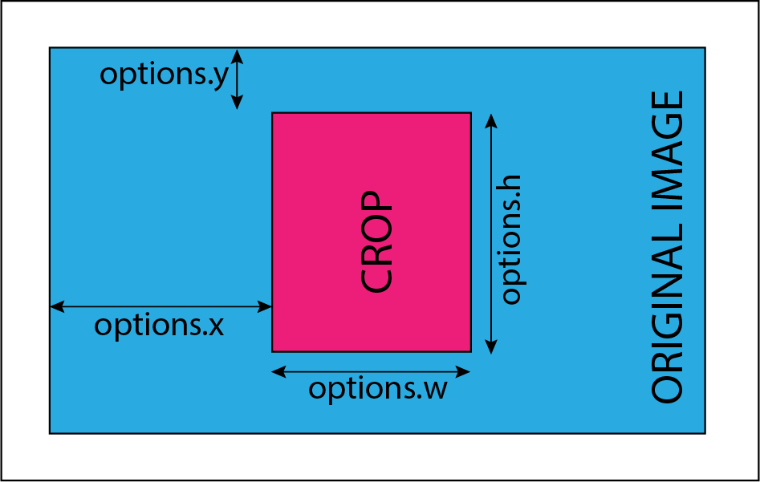

Documentation of various Modules
===

List of Module Documentations

1.  [Crop](#crop-module)
2.  [Segmented-Colormap](#segmented-colormap-module)
3.  [FisheyeGl](#fisheyeGl-module)
4.  [Average](#average-module)
5.  [Blend](#blend-module)
6.  [Blur](#blur-module)
7.  [Brightness](#brightness-module)
8.  [Channel](#channel-module)
9.  [Colorbar](#colorbar-module)
10. [Colormap](#colormap-module)
11. [Contrast](#contrast-module)
12. [Convolution](#convolutioon-module)
13. [DecodeQr](#decodeQr-module)
14. [Dynamic](#dynamic-module)
15. [Edge-Detect](#edge-detect-module)
16. [Gamma-Correction](#gamma-correction-module)
17. [Gradient](#gradient-module)
18. [Histogram](#histogram-module)
19. [Import-image](#import-image-module)
20. [Invert](#invert-module)
21. [Ndvi](#ndvi-module)
22. [Ndvi-Colormap](#ndvi-colormap-module)
23. [Overlay](#overlay-module)
24. [Resize](#resize-module)
25. [Rotate](#rotate-module)
26. [Saturation](#saturation-module)


## crop-module

This module is used to crop an image.

#### Usage

```js
  sequencer.loadImage('PATH')
           .addSteps('crop',options)
           .run();
```
Where `options` is an object having the properties `x`, `y`, `w`, `h`. This diagram defines these properties:



#### Defaults

* `options.x` : 0
* `options.y` : 0
* `options.w` : half of image width
* `options.h` : half of image height


## segmented-colormap-module

This module is used to map the pixels of the image to a segmented colormap.

#### Usage

```js
  sequencer.loadImage('PATH')
           .addSteps('segmented-colormap',options)
           .run()
```

where `options` is an object with the property `colormap`. `options.colormap` can be:

* "default" : [[0, [0, 0, 255], [38, 195, 195]], [0.5, [0, 150, 0], [255, 255, 0]], [0.75, [255, 255, 0], [255, 50, 50]]]

* "greyscale" : [[0, [0, 0, 0], [255, 255, 255]], [1, [255, 255, 255], [255, 255, 255]]]

* "stretched" : [[0, [0, 0, 255], [0, 0, 255]], [0.1, [0, 0, 255], [38, 195, 195]], [0.5, [0, 150, 0], [255, 255, 0]], [0.7, [255, 255, 0], [255, 50, 50]], [0.9, [255, 50, 50], [255, 50, 50]]]

* "fastie" : [[0, [255, 255, 255], [0, 0, 0]], [0.167, [0, 0, 0], [255, 255, 255]], [0.33, [255, 255, 255], [0, 0, 0]], [0.5, [0, 0, 0], [140, 140, 255]], [0.55, [140, 140, 255], [0, 255, 0]], [0.63, [0, 255, 0], [255, 255, 0]], [0.75, [255, 255, 0], [255, 0, 0]], [0.95, [255, 0, 0], [255, 0, 255]]]

* A custom array.

## fisheyeGl-module

This module is used for correcting Fisheye or Lens Distortion

#### Usage

```js
  sequencer.loadImage('PATH')
           .addSteps('fisheye-gl',options)
           .run()
```

where `options` is an object with the following properties:
* a : a correction (0 to 4; default 1)
* b : b correction (0 to 4; default 1)
* Fx : x correction (0 to 4; default 1)
* Fy : y correction (0 to 4; default 1)
* scale : The ratio to which the original image is to be scaled (0 to 20; default 1.5)
* x : Field of View x (0 to 2; default 1)
* y : Field of View y (0 to 2; default 1)

## average-module

This module is used for averaging all the pixels of the image.

#### Usage

```js
  sequencer.loadImage('PATH')
           .addSteps('average',options)
           .run()
```

## blend-module

This module is used for blending two images .
#### Usage

```js
  sequencer.loadImage('PATH')
           .addSteps('blend',options)
           .run()
```

where `options` is an object with the following properties:
* offset: step of image with which current image is to be blended(Two steps back is -2, three                steps back is -3 etc; default -2) 
* func: function used to blend two images (default : function(r1, g1, b1, a1, r2, g2, b2, a2) {            return [ r1, g2, b2, a2 ] })

## blur-module

This module is used for applying a Gaussian blur effect.
#### Usage

```js
  sequencer.loadImage('PATH')
           .addSteps('blur',options)
           .run()
```

where `options` is an object with the following property:
* blur : Intensity of Gaussian blur (0 to 5; default 2)

## brightness-module

This module is used for changing the brightness of the image.


#### Usage

```js
  sequencer.loadImage('PATH')
           .addSteps('brightness',options)
           .run()
```

where `options` is an object with the following property:
* brightness : brightness of the image in percentage (0 to 100; default 100)

## channel-module

This module is used for forming a grayscale image by applying one of the three primary colors.

#### Usage

```js
  sequencer.loadImage('PATH')
           .addSteps('channel',options)
           .run()
```

where `options` is an object with the following property:
* channel : color of the channel (red, green, blue; default green)

## colorbar-module

This module is used for displaying an image with a colorbar.

#### Usage

```js
  sequencer.loadImage('PATH')
           .addSteps('colorbar',options)
           .run()
```

where `options` is an object with the following properties:
* colormap : Name of the Colormap(default, greyscale, stretched, fastie, brntogrn, blutoredjet,                 colors16; default: default)
* x : X-position of the image on which the new image is overlayed (default 0)
* y : Y-position of the image on which the new image is overlayed (default 0)
* h : height of resulting cropped image (default : 50% of input image width )

## colormap-module

This module is used for mapping brightness values (average of red, green & blue) to a given color  lookup table, made up of a set of one more color gradients.

#### Usage

```js
  sequencer.loadImage('PATH')
           .addSteps('colormap',options)
           .run()
```

where `options` is an object with the following property:
* colormap : Name of the Colormap ( greyscale, stretched, fastie, brntogrn, blutoredjet,                        colors16)

## contrast-module

This module is used for changing the contrast of the image.

#### Usage

```js
  sequencer.loadImage('PATH')
           .addSteps('contrast',options)
           .run()
```

where `options` is an object with the following property:
* contrast : contrast for the given image (-100 to 100; default : 70)

## convolution-module

This module is used for performing image-convolution.

#### Usage

```js
  sequencer.loadImage('PATH')
           .addSteps('convolution',options)
           .run()
```

where `options` is an object with the following properties:
* constantFactor : a constant factor, multiplies all the kernel values by that factor (default :                     1/9)
* kernelValues : nine space separated numbers representing the kernel values in left to right and                   top to bottom format(default : 1 1 1 1 1 1 1 1 1)

## decodeQr-module

This module is used for decoding a QR in image (if present).

#### Usage

```js
  sequencer.loadImage('PATH')
           .addSteps('decode-qr',options)
           .run()
```
## dynamic-module

This module is used for producing each color channel based on the original image's color.

#### Usage

```js
  sequencer.loadImage('PATH')
           .addSteps('dynamic',options)
           .run()
```

where `options` is an object with the following properties:
* red : expression for red channel (R, G, B and A as inputs; default r)
* green : expression for green channel (R, G, B and A as inputs; default g)
* blue : expression for blue channel (R, G, B and A as inputs; default b)
* monochrome: fallback for other channels if none provided (default : r+g+b/3)

## edge-detect-module

This module is used for detecting images.
#### Usage

```js
  sequencer.loadImage('PATH')
           .addSteps('edge-detect',options)
           .run()
```

where `options` is an object with the following properties:
* blur :  Intensity of Gaussian blur (0 to 5; default 2)
* highThresholdRatio : Upper Threshold Ratio ( default : 0.2)
* lowThresholdratio : Lower Threshold Ratio ( default : 0.2)

## gamma-correction-module

This module is used for applying gamma correction.
#### Usage

```js
  sequencer.loadImage('PATH')
           .addSteps('gamma-correction',options)
           .run()
```

where `options` is an object with the following property:
* adjustment : Inverse of actual gamma factor (default 0.2)

## gradient-module

This module is used for finding gradient of the image.
#### Usage

```js
  sequencer.loadImage('PATH')
           .addSteps('gradient',options)
           .run()
```

## histogram-module

This module is used for calculating histogram of the image.
#### Usage

```js
  sequencer.loadImage('PATH')
           .addSteps('histogram',options)
           .run()
```

where `options` is an object with the following property:
* gradient : boolean value used to toggle gradient along x-axis (true or false; default true)

## import-image-module

This module is used for importing a new image and replacing the original with it.
#### Usage

```js
  sequencer.loadImage('PATH')
           .addSteps('import-image',options)
           .run()
```

where `options` is an object with the following property:
* url : url of the  new image (local image url or data url;default : "./images/monarch.png")

## invert-module

This module is used for inverting the image.
#### Usage

```js
  sequencer.loadImage('PATH')
           .addSteps('invert',options)
           .run()
```

## ndvi-module  

This module is used for applying ndvi technique to the image.
#### Usage

```js
  sequencer.loadImage('PATH')
           .addSteps('ndvi',options)
           .run()
```

where `options` is an object with the following property:
* filter : filter for NDVI (blue or red; default red)

## ndvi-colormap-module

This module is used for demonstrating ndvi and colormap properties consecutively.
#### Usage

```js
  sequencer.loadImage('PATH')
           .addSteps('ndvi-colormap',options)
           .run()
```

## overlay-module

This module is used for overlaying an Image over another .
#### Usage

```js
  sequencer.loadImage('PATH')
           .addSteps('overlay',options)
           .run()
```

where `options` is an object with the following properties:
* x : X-position of the image on which the new image is overlayed (default 0)
* y : Y-position of the image on which the new image is overlayed (default 0)
* offset : offset to the step on which the output of the last step is overlayed (default -2)

## resize-module

This module is used for resizing an image.
#### Usage

```js
  sequencer.loadImage('PATH')
           .addSteps('resize',options)
           .run()
```

where `options` is an object with the following property:
* resize : Percentage value of resize (default 125%)

## rotate-module

This module is used for rotating an image.
#### Usage

```js
  sequencer.loadImage('PATH')
           .addSteps('rotate',options)
           .run()
```

where `options` is an object with the following property:
* rotate : angular value for rotation in degrees (between 0 and 360; default 0)

## saturation-module

This module is used for changing the saturation of the image.
#### Usage

```js
  sequencer.loadImage('PATH')
           .addSteps('saturation',options)
           .run()
```

where `options` is an object with the following property:
* saturation : saturation for the new image (between 0 and 2; default 0)


