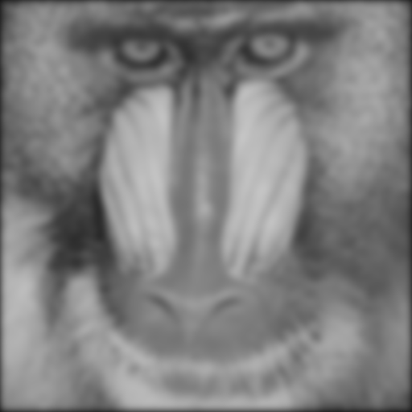

ndarray-gaussian-filter
=======================
An FFT based Gaussian filter for ndarrays.

[](http://travis-ci.org/scijs/ndarray-gaussian-filter)

## Example

```javascript
var baboon = require("luminance")(require("baboon-image"))
var savePixels = require("save-pixels")
var blur = require("ndarray-gaussian-filter")
savePixels(blur(baboon, 5), "png").pipe(process.stdout)
```

#### Output


## Install
Install using [npm](https://www.npmjs.com/):

    npm install ndarray-gaussian-filter

## API

#### `require("ndarray-gaussian-filter")(array,radius[,wrap])`
Filters an ndarray using a Gaussian filter.

* `array` is an ndarray.
* `sigma` is the radius of the Gaussian filter. Can be either a scalar or an array.
* `wrap` is checks whether the filter is applied as a circular convolution or uses `0` boundary. Default is `false`. Can be set as an array to select boundary conditions independently for each axis.

**Returns** `array`

## License
(c) 2014 Mikola Lysenko. MIT License